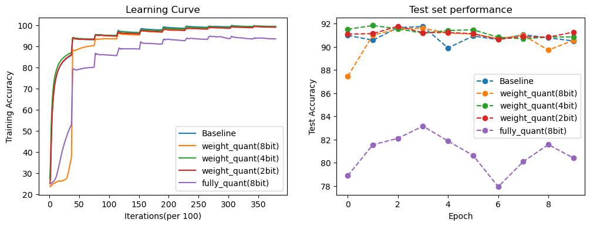
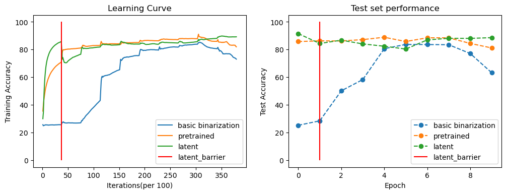

# Project Description: Transformer-Quantization
It is the final project repository for 2022 Spring COMS6998-E009 Practical Deep Learning System Performance in Columbia University. This repository is about conducting quantization and binarization on transformer models.

**Motivation**: Transformer is becoming SOTA base model for many NLP&CV tasks because of its ability to accomodate large-scale data. However, the main disadvantage of transformer is its large model size and even larger runtime memory usage. Therefore, it is important to explore diverse ways to compress model to lower hardware cost. Among diverse model compression techniques, quantization wins out because of its simplicity of implementation, preservation of original model structure and robustness to noise. 

Current quantization methods are mostly designed on CNN and tested on Image Classification Task. However, there is huge difference between CNN and Transformer architecture. CNN has convolution as its base operation, while transformer relies mostly on Multi-head Attention module. They have totally different feature. So how to explore efficient and effective quantization method for transformer is main focus of our project.

**Goal**: We want to

1. Implement and modify diverse quantization and binarization methods from CNN to see if it still works well on transformer
2. Explore the internal feature of transformer structure and design special quantization pattern to improve quantization performance on transformer
3. Reach a trade-off between model size and bearable classification error as an optimal compression strategy

**Approach**: We construct a transformer model with two encoder layers for text classification task as our baseline. We use AG_NEWS as target dataset. Basic quantization and binarization methods are implemented and tested on transformer, then two optimized algorithm from fully-quantization and IR Net are implemented to improve quantization performance. We also explored sensitivity of different parts of transformer and designed a speical pattern for transformer quantization that only quantizing Query and Key without Value, based on the observation that we only cares similarity between query and key instead of absolute values. At last, we proposed a new method called latent quantization, which train full precision model for a few epochs at beginning then switch to quantized model. This method is proved to be effective.

**Experiments**: We designed three experiments to explore quantization pattern for transformer.

In our first experiment, we implement and modify diverse quantization methods from CNN to see if it still works well for transformer.

Our second experiment is focused on sensitivity of different parts of transformer. We leave out input embedding layer and quantize other parts of transformer respectively to see the sensitivity of each part. Then based on our observation, we designed two improvements to accommodate specialty of transformer.

Our third experiment is inspired by a paper which says initializing weights from pre-trained fullprecision model instead of random values will increase quantized model’s performance. We verified this conclusion, then changed it a little bit to train model from scratch as full precision for a few epochs at start, then switch to quantized model and inherit current weights, and finally train to converge. We call this idea latent training because quantization happens a few epochs later.

For all models on all experiments, we maintained the same training setting and trained for 10 epochs for comparability.
 

# Code Structure

**/quantization**: core codes including transformer definition, quantization, binarization. 

Inside this directory, `transformer.py` - definition of baseline transformer model; `quantize.py` - codes for basic quantization (weight only); `fully_quantize.py` - codes for fully quantization (quantize both weight and activation);  `binarize.py` - codes for basic and IR-Net binarization; `pytorch_api.py` - pytorch API for simple quantization, used for quickly go through essential ideas of quantization, not used in final experiment
 
**/utils**: util functions used in model training and other experiments

Inside this directory, `constants.py` - some pre-defined constants for model definition and training; `data_utils.py` - functions to construct dataset; `train_utils.py` - help functions used in training; `training.py` - core training codes; `check_activation.py` - functions used to compute runtime memory size; `pretrained.py` - functions to load pre-trained model weights; `utils.py` - other help functions


**/res**: save models, training logs, test results of different experiments

**/figures**: save figures for expeirments

`train_script.py`: main function to train model w or w/o quantization

`plot.ipynb`: used to plot figures

# Example commands to run

Training codes for different baseline/quantized/binarized model are provided in this repository. To run it, you should first install all requirements by

```
pip3 install -r requirements.txt
```

## Train baseline model

To train baseline transformer model on AG_NEWS dataset without any quantization/binarization, you can use command without any arugments, which is

```
python3 train_script.py
```

## Train quantization model

To train quantization model, you should specify argument `--quant_type` to 'quantization', and you can choose quantize method from ['basic', 'fully'] by specifying argument `--quant_method`, also you must specify bit number for paramter and/or activation by setting argument `--bit_num` as one of [8,4,2].

For example, if you want to train a model using fully quantization and 8 bit, you can use command like 

```
python3 train_script.py --quant_type quantization --quant_method fully --bit_num 8
```

## Train binarization model

Training of binarization model is similar, you should specify argument `--quant_type` as 'binarization' and choose quantize method from ['basic', 'ir'] and set as argment `--quant_method`. However, for binarization method, `--bit_num` will not work since every parameter will be set as 1bit. Instead, you can binarize part of the model by specifying argument `--quant_pattern` as one of ['MHA', 'FFN', 'CLS', 'ALL', 'ALL_QK'], which means binarizing multi-head attention layer, feedforward layer, classifier, all model, all model with only query/key without value respectively.

For example, if you want to train a model using IR-Net binarization and binarize the whole model with QK, you can use command like


```
python3 train_script.py --quant_type binarization --quant_method ir --quant_pattern ALL_QK
```

## Pre-trained weights and latent quantization

Loading pre-trained weights and latent quantization are two tricks that designed to improve quantization performance. They are compatible with any quantized model with addition argument `--pre_trained` and `--latent`

For example, if you want to train a similar binarization model but uses pre-trained weight or latent quantization trick, you can use command like 

```
python3 train_script.py --quant_type binarization --quant_method ir --quant_pattern ALL_QK --pre_trained
```

```
python3 train_script.py --quant_type binarization --quant_method ir --quant_pattern ALL_QK --latent
```

# Experiment and Results

## Experiment 1: Effectiveness of different quantization methods
In our first experiment, we implement and modify diverse quantization methods from CNN to see if it still works well for transformer. Here are the results for our first experiment. On the left is the training curve plotted every 100 iterations. On the right side is the test set performance for every epoch. On bottom is the final performance and model size table. First part if for quantization and second part is for binarization.

### Quantization part



### Binarization part


### Observation

For quantization, we can see that basic quantization, which quantizes weight only, performs very well, it reduces model size a lot with nearly no sacrifice of accuracy. To continue, we develop model based on fully quantization method, which quantizes both weight and activation. This model has large runtime size reduction, but suffers from a drop in performance, which indicates that activation is more important for transformer. We will design different methods to improve later.

For binarization, the model size is significantly reduced, but also a large drop in performance can be observed, which results from extremely limited model representation ability. After IR Net binarization is implemented, there is an increasement in performance.


## Experiment 2: Sensitivity of different parts of transformer
For our second experiment, we first compute out parameter distribution for each model part, excluding input embedding layer.


Then we binarize each part respectively to see the difference. For simplicity and observability of result, we only conduct binarize here and believe the same conclusion can also be observed when quantization.


First, we can observe that MHA is the most important part in transformer, binarization of it brings same model size reduction with FFN but makes performance drop a lot. It also makes model converge much slower.

On the opposite, FFN is insensitive to binarization, which brings nearly no performance decreasement. So it is the most robust part and can be binarized safely.

Binarizing CLS can also give great performance in a few epochs at beginning, but model will collapse in very late training process. However, if the whole model is binarized, it cannot learn anything. We will solve this problem by next two improvements.

### Improvement1 - Final linear layer is crucial

After some analysis, we found that the final linear layer in classifier is crucial. We trained two models, one with all layers binarized and one with all but final layer binarized. Results are shown below:


We can see that if the final layer remains full precision, the whole model performance will increase to normal. We guess that it is because final layer controls the output scores for each class, if binarized, the output space may be too restricted to distinguish between classes.

### Improvement2- Treat Q,K,V in attention layer differently

Then, as we discussed before, we think query and key should be more robust to binarization based on the intuition that similar items should still be similar even if binarized. We compares model with QKV all binarized and that with only QK binarized. To ensure that the improvement does not come from increasement of full precision parameters. We also trained model with only QV and KV binarized. The results show that QK Only model has significant better performance over others, which proves our assumption. Results are shown below:


## Experiment 3: Effect of latent quantization

In our third experiment, we first train models with pre-trained full precision weights as initialization. Then, we test our latent quantization idea on both models. Based on the observation of training process of baseline model, we find that full-precision model achieves high performance at first epoch. So, we set our latent barrier as one. It means, we will train our model as full precision for 1 epoch, and switch to quantized model, then finish remaining 9 epochs. Results are shown below:





We can see that for both quantization and binarization, pre-trained weights not only accelerate convergence, but also lead to better generalization performance, which verifies the argument in the original paper. And we surprisingly found that latent quantization can achieve even better results. We guess the reason behind is that the full-precision model has different optimal solution space with quantized model. It means trained weights can provide prior knowledge in quantized model, but converged weights will harm the performance a little bit because it lies in different solution space. Note that an important advantage of our method is that we do not need pretrained weights anymore, which may accelerate whole training process.
